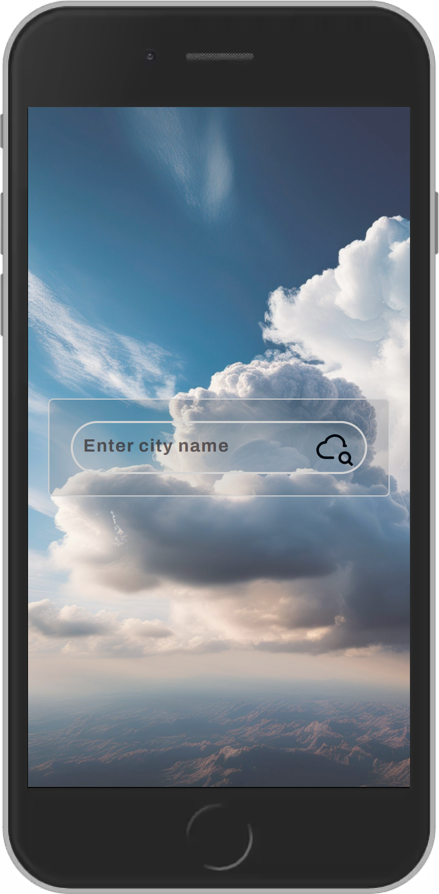
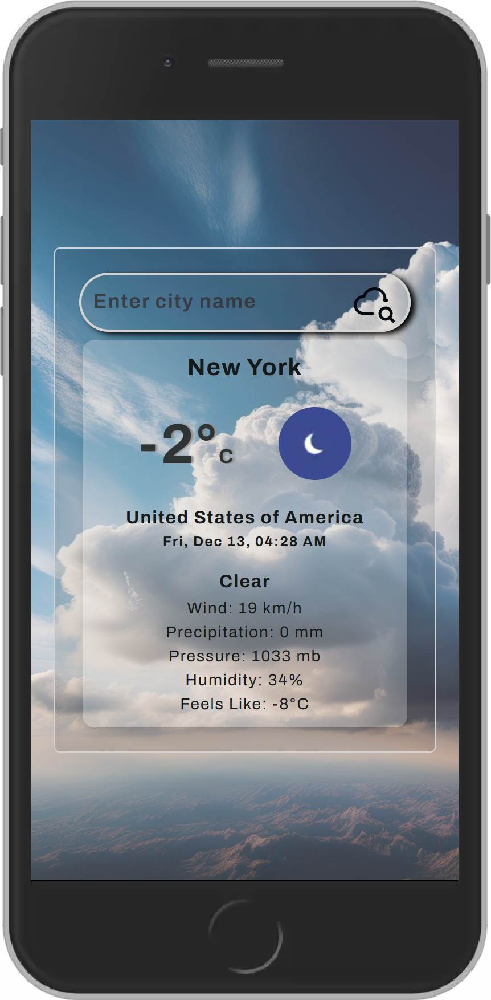
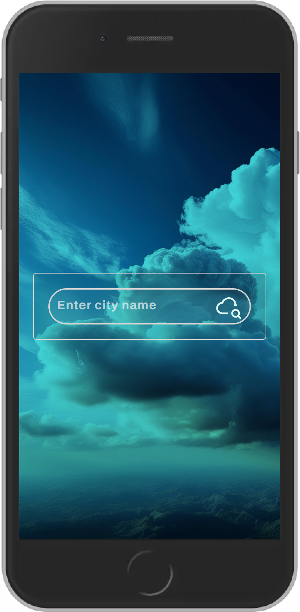
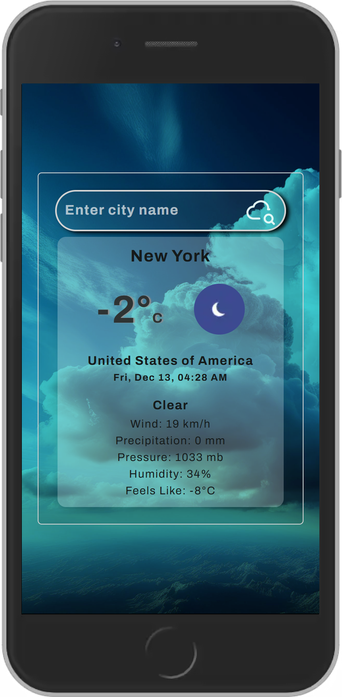

# Vants Weather App

## Contents

- [Description](#description)
- [Features](#features) 
- [Output](#output) 
- [Installation](#installation) 
- [Usage](#usage)
- [Author Notes](#author-notes)
- [License](#license) 

## Description

This weather app gets weather data from the WeatherStack API and displays current weather for a specific location.

### Technologies & References

- Visual Studio Code
- Vite
- React Typescript
- Service Worker
- WeatherStack API
- CSS and TailwindCss

## Features

- Displays current weather for location.
- Responsive design for mobile and desktop screens.
- Caches data for use offline - Stale While Revalidate caching 

## Output

<p>




</p>

[Live Demo](https://avantenaidoo.github.io/vants_weather_app/)
*located in "gh-pages" branch of this repository*

[Back to Top](#vants-weather-app)

## Installation

1. **Clone the repository and navigate to the Project Directory**:
   ```bash
   git clone https://github.com/yourusername/vants_weather_app.git
   cd weather-app
   ```

2. **Install dependencies**:
    ```bash
    npm install
    ```

3. **Create .env file in the root directory and add your WeatherStack API Key**:
    ```env
    VITE_WEATHERSTACK_API_KEY=0123456789
    ```
    *Paste your API without a semi-colon*

4. **Run the app**:
    ```bash
    npm run dev
    ```
[Back to Top](#vants-weather-app)

## Usage

- Navigate to your browser and follow the link provided.
- Enter a city name to view current weather conditions.

### How to get your WeatherStack API Key

- Head to the [WeatherStack API](https://weatherstack.com/signup/free) site and sign up for free.

## Author Notes

- Live Demo may not have renewed or valid API Key 
- Light/Dark mode auto adjusts based on device settings
- Background Image created in Adobe Express. 
- Design and color/colours - inspiration from Tamz & Rob 🕊️. Favicon is personal brand from scuba diving...
- App is still being improved from time to time. It does need more improvements, please feel free to contribute and/share insights

[Back to Top](#vants-weather-app)


## License

[](LICENSE)